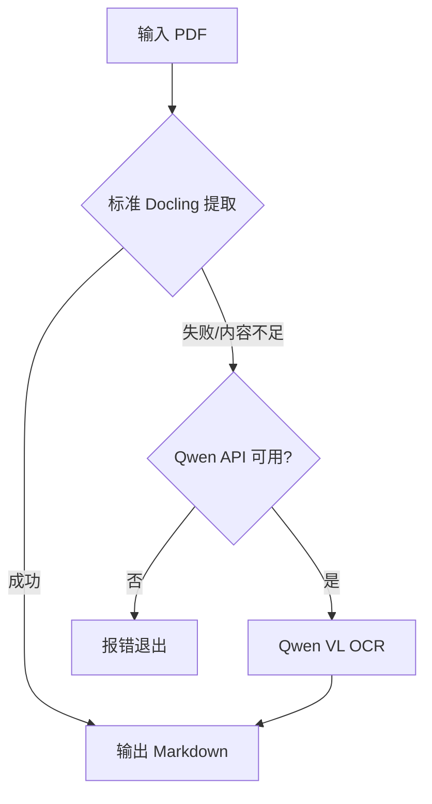

# Docling Qwen Pipeline 测试指南

## ✅ 脚本已创建完成

`docling_qwen_pipeline.py` 是一个集成了 Docling 和 Qwen VL 的 PDF 处理管线。

---

## 📋 测试方法

### 1️⃣ 测试 1: 查看帮助信息

```bash
python3 docling_qwen_pipeline.py --help
```

**预期结果**: 显示完整的使用说明和参数列表

---

### 2️⃣ 测试 2: 处理在线 PDF（无需 API Key）

```bash
# 预览模式（不保存文件）
python3 docling_qwen_pipeline.py "https://arxiv.org/pdf/2408.09869" --preview-only

# 保存到文件
python3 docling_qwen_pipeline.py "https://arxiv.org/pdf/2408.09869"
```

**预期结果**: 
- ✅ 使用 Docling 标准管线提取 PDF 内容
- ✅ 输出前 500 字符预览
- ✅ 保存到 `output_output.md`（如果不用 --preview-only）

---

### 3️⃣ 测试 3: 处理本地 PDF（标准文本 PDF）

```bash
# 找一个本地 PDF 文件测试
python3 docling_qwen_pipeline.py /path/to/your/document.pdf
```

**预期结果**: 
- ✅ 提取文本内容
- ✅ 保存到 `document_output.md`

---

### 4️⃣ 测试 4: 处理受保护/扫描 PDF（需要 Qwen API Key）

这是针对 `潘易_Android_简历.pdf` 这类无法直接提取文字的 PDF。

#### 步骤 1: 配置 API Key

```bash
# 方法 1: 使用 .env 文件
echo "DASHSCOPE_API_KEY=your-api-key-here" >> .env

# 方法 2: 导出环境变量
export DASHSCOPE_API_KEY="your-api-key-here"
```

获取 API Key: https://dashscope.console.aliyun.com/apiKey

#### 步骤 2: 运行测试

```bash
# 自动回退到 Qwen VL（当标准提取失败时）
python3 docling_qwen_pipeline.py /Users/sunyin/Desktop/潘易_Android_简历.pdf

# 或强制使用 Qwen VL
python3 docling_qwen_pipeline.py /Users/sunyin/Desktop/潘易_Android_简历.pdf --use-qwen
```

**预期结果**:
- 🔄 Docling 标准管线尝试提取
- ⚠️ 内容不足，自动切换到 Qwen VL OCR
- 🤖 使用 Qwen VL API 逐页识别
- ✅ 保存完整内容到 `潘易_Android_简历_output.md`

---

## 🎯 测试场景总结

| 测试场景 | 命令 | 需要 API Key |
|---------|------|------------|
| 在线 PDF | `python3 docling_qwen_pipeline.py "https://arxiv.org/pdf/xxx"` | ❌ 不需要 |
| 本地普通 PDF | `python3 docling_qwen_pipeline.py document.pdf` | ❌ 不需要 |
| 受保护/扫描 PDF | `python3 docling_qwen_pipeline.py resume.pdf` | ✅ 需要（自动回退） |
| 强制 Qwen OCR | `python3 docling_qwen_pipeline.py resume.pdf --use-qwen` | ✅ 需要 |

---

## 🔧 高级选项

### 强制 OCR 所有页面

```bash
python3 docling_qwen_pipeline.py document.pdf --force-ocr
```

### 禁用 OCR（仅提取原生文本）

```bash
python3 docling_qwen_pipeline.py document.pdf --no-ocr
```

### 自定义输出路径

```bash
python3 docling_qwen_pipeline.py document.pdf -o my_output.md
```

### 仅预览不保存

```bash
python3 docling_qwen_pipeline.py document.pdf --preview-only
```

---

## 📊 工作流程说明



### 处理逻辑

1. **第一步**: 尝试使用 Docling 标准管线（速度快，免费）
   - 如果提取内容 > 100 字符 → 成功 ✅
   - 如果内容太少 → 进入第二步

2. **第二步**: 自动回退到 Qwen VL OCR（准确度高，需要 API Key）
   - 将 PDF 转换为图片
   - 逐页调用 Qwen VL API 识别
   - 合并所有页面内容

---

## ⚠️ 常见问题

### Q1: 提示 "DASHSCOPE_API_KEY not found"

**解决方法**:
```bash
export DASHSCOPE_API_KEY="sk-xxxxx"
# 或创建 .env 文件
echo "DASHSCOPE_API_KEY=sk-xxxxx" > .env
```

### Q2: 提示缺少依赖

**解决方法**:
```bash
# 安装 Docling 依赖
pip install docling

# 安装 Qwen VL 依赖（如果需要）
pip install dashscope pymupdf pillow
```

### Q3: PDF 文件找不到

**解决方法**:
- 使用绝对路径: `/Users/sunyin/Desktop/document.pdf`
- 或确保在正确的目录下运行脚本

---

## 🎉 快速测试（推荐）

```bash
# 1. 测试基本功能（在线 PDF，不需要 API Key）
python3 docling_qwen_pipeline.py "https://arxiv.org/pdf/2408.09869" --preview-only

# 2. 如果有 API Key，测试完整功能
export DASHSCOPE_API_KEY="your-key"
python3 docling_qwen_pipeline.py /Users/sunyin/Desktop/潘易_Android_简历.pdf
```

---

## 📝 输出示例

### 成功输出示例

```
📄 Processing: document.pdf
================================================================================

✅ Extraction successful! (35374 characters)

================================================================================
📝 CONTENT PREVIEW (first 500 characters):
================================================================================
# Document Title

This is the extracted content...
================================================================================

💾 Saved to: /path/to/document_output.md
```

### Qwen VL 回退示例

```
🔄 Step 1: Trying standard Docling pipeline...
⚠️  Docling extracted insufficient content, trying Qwen VL...

🤖 Step 2: Using Qwen VL OCR...
   Converting 3 pages to images...
   Processing page 1/3... ✓
   Processing page 2/3... ✓
   Processing page 3/3... ✓

✅ Qwen VL extraction successful!
   Extracted 5234 characters
```

---

## 💡 提示

- **第一次运行**: Docling 会下载模型，需要等待几分钟
- **网络问题**: 在线 PDF 需要能访问对应网站
- **API 限制**: Qwen API 有调用频率限制，大文件可能较慢
- **成本考虑**: Qwen VL API 需要付费，建议先用标准管线

---

## 🔗 相关链接

- Docling 文档: https://docling-project.github.io/docling/
- Qwen API 控制台: https://dashscope.console.aliyun.com/
- 获取 API Key: https://dashscope.console.aliyun.com/apiKey

